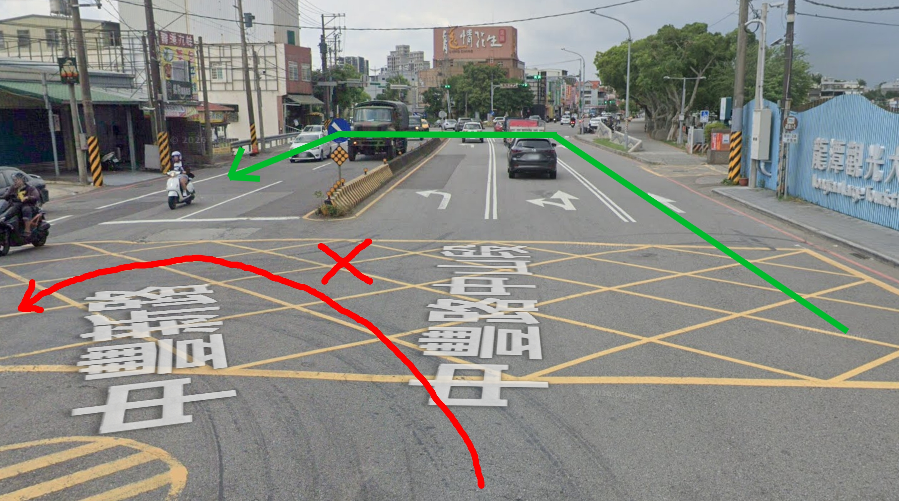
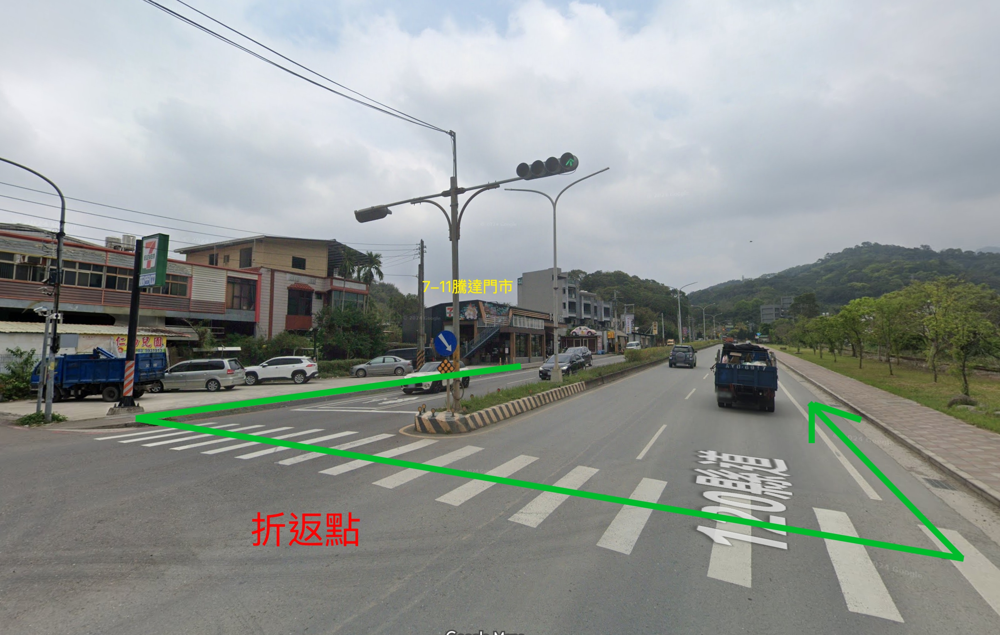
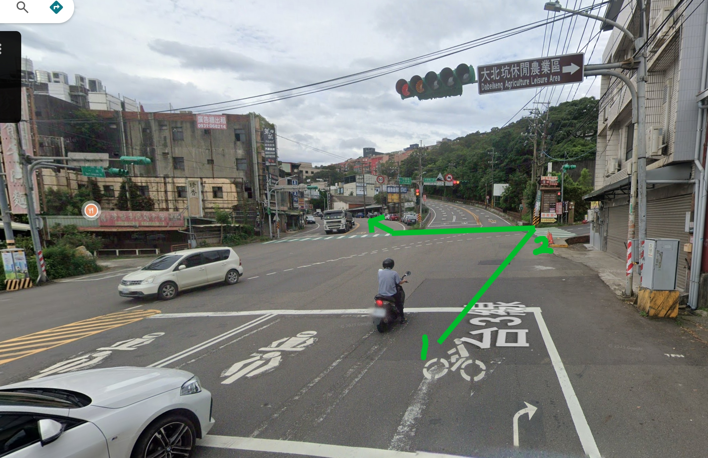
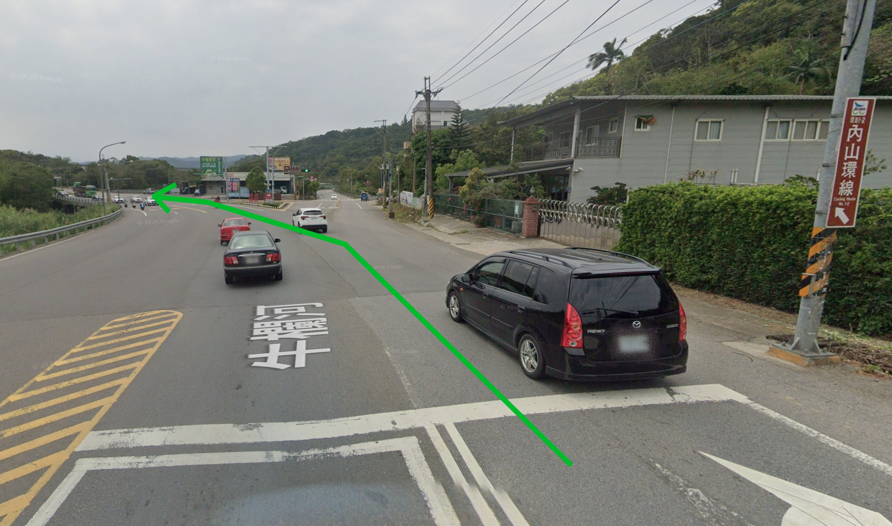
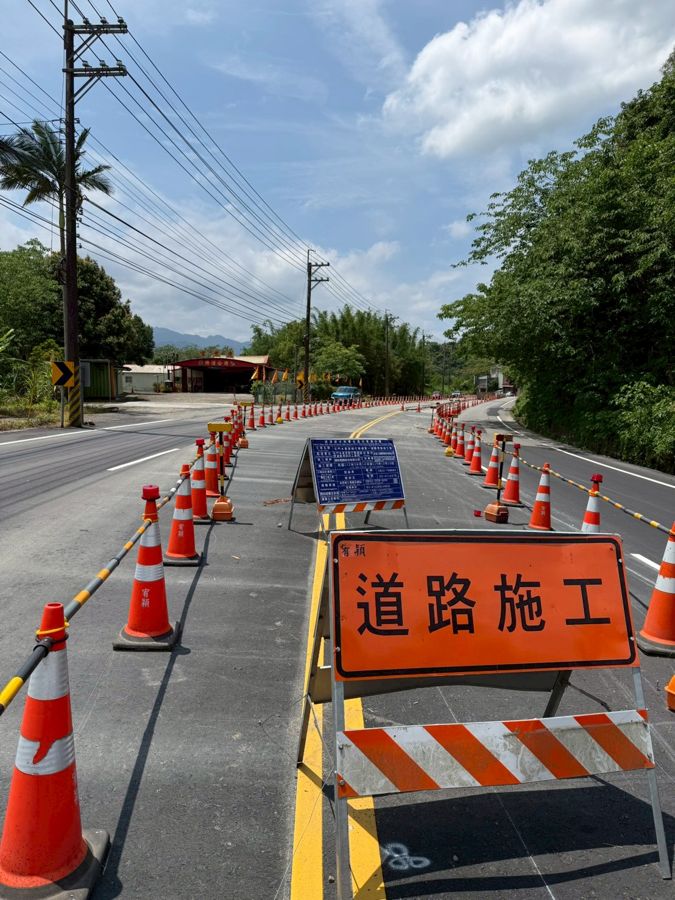

# 小鐵人台三線騎行會前會 — 會議記錄

---

## 1. 路線與分隊安排

- 本次**路線統一、分隊不分組**。
- **黑豆**及**砂糖橘**需安排鐵爸、鐵媽專程照顧。

---

## 2. 折返點與補給路線

- 折返點為 **7-11 騰達門市**。（[參見附件圖5](#附件圖5)）
- 中途補給地點（去程 1 站、回程 2 站）：

| 順序 | 地點 |
|:---|------|
| 起點 | 龍潭大池 |
| 去程補給 | 休息點 1(國道3號路橋下) |
| 折返點＋休息 | 7-11 騰達門市 |
| 回程補給 | 休息點 2(濟世宮) → 休息點 3(中油正新站) |
| 終點 | 龍潭大池 |

---

## 3. 休息時間控制

- 每次休息時間請控制在 **10～15 分鐘**，由領隊負責管控。

---

## 4. 交管與安全注意事項

- 擔心騎錯路口，需安排**交管待轉**（由領隊及補給人員負責）。
  - 兩處關鍵路口（[參見附件圖2](#附件圖2)、[附件圖3](#附件圖3)）
- **施工路段**請注意安全：領隊需提醒減速慢行，單線依序通過。
- 分隊時，需安排好**領隊、壓隊、交管**人員。

---

## 5. 補給車負責人

- 補給車由 **羊來了** 及 **金錢豹** 負責。

---

## 6. 費用說明

| 項目 | 費用 | 備註 |
|------|:---:|------|
| 活動費（不分大小鐵） | $200／人 | 含補給、保險 |
| 來賓及非年費成員加收 | +$100／人 | 來賓合計 $300 |
| 便當 | $100／份 | 便當菜單於報名時提供 |

---

## 7. 關鍵行程時間表

| 時間 | 事項 |
|:---:|------|
| 07:00 | 集合 |
| 07:20 | 團體拍照 |
| 07:30 | 出發 |
| 約 11:30 | 返回龍潭大池休息、用餐 |
| 餐後 | 慶生活動 |

---

## 8. 報名資訊

- **開放報名時間**：5/9（五）～ 5/15（四）
- 5/7（三）完成行前說明製作，由群組統一確認後公佈。

---

## 9. 慶生蛋糕

- 蛋糕以**方便攜帶**為主，由 **荔枝** 負責訂購。

---

## 10. 午餐及慶生地點

- **龍潭大池**停車場後方，可步行抵達。

---

## 11. 補給品規劃

- 補給品以**每人 $50** 預估。
- 水、飲料、冰塊由補給組人員斟酌準備。
- 考慮到天氣炎熱，將準備 **2 組冰桶**，分別置於補給車。

---

## 12. 雨天備案

- 請提醒所有參加者**備齊騎行雨具**。
- 施工路段務必小心，領騎注意控速。領隊可視情況決定是否牽車（[參見附件圖4](#附件圖4)）
- 如真的下大雨路況不佳，請領隊、鐵爸、鐵媽們提醒小鐵人，在雨中騎車的注意事項有哪些？路況不好時還是要**盡力完成訓練喔！**，這是小鐵人的精神！

---

## 📌 備註

> 龍潭大池停車場出發後**右轉**，請在交通號誌燈號處**迴轉**（[參見附件圖1](#附件圖1)）。

---

## 📋 工作分配表

| 編號 | 工作項目 | 負責人 |
|:---:|----------|:------:|
| 1 | 行前說明／活動簡章 | 翼龍 |
| 2 | 小掌櫃（財務） | 開心果 |
| 3 | 餐廳／便當安排 | 高鐵 |
| 4 | 訂蛋糕 | 荔枝 |
| 5 | 製作報名表 | 金錢豹 |
| 6 | 小鐵人分組 | 熊鷹／瑪麗貓 |
| 7 | 採買補給品 | 鱸鰻 |
| 8 | 補給組 | 羊來了 |
| 9 | 設計活動貼紙 | 紅豆 |

---

## 📎 附件：路線參考圖

---

### 附件圖1：出發迴轉路口示意圖

> 龍潭大池停車場出發右轉後，於號誌燈處迴轉。

---

### 附件圖5：折返點 — 7-11 騰達門市

> 折返點位於 7-11 騰達門市，120 縣道旁。

### 附件圖2：關鍵路口 1

> 交管待轉路口（大北坑方向）。

---

### 附件圖3：關鍵路口 2

> 交管待轉路口（內山環線方向）。

### 附件圖4：施工路段現況

> 道路施工中，請減速慢行，必要時牽車通過。

